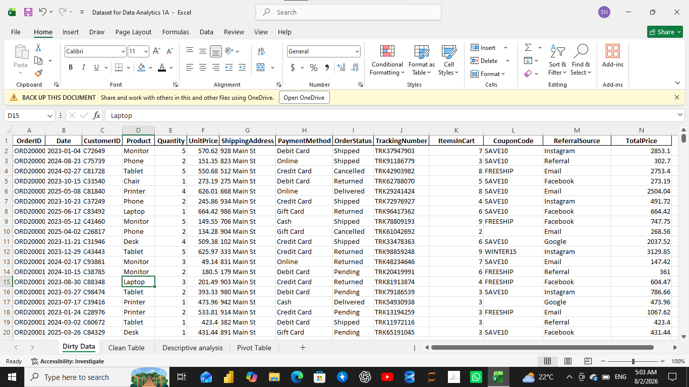
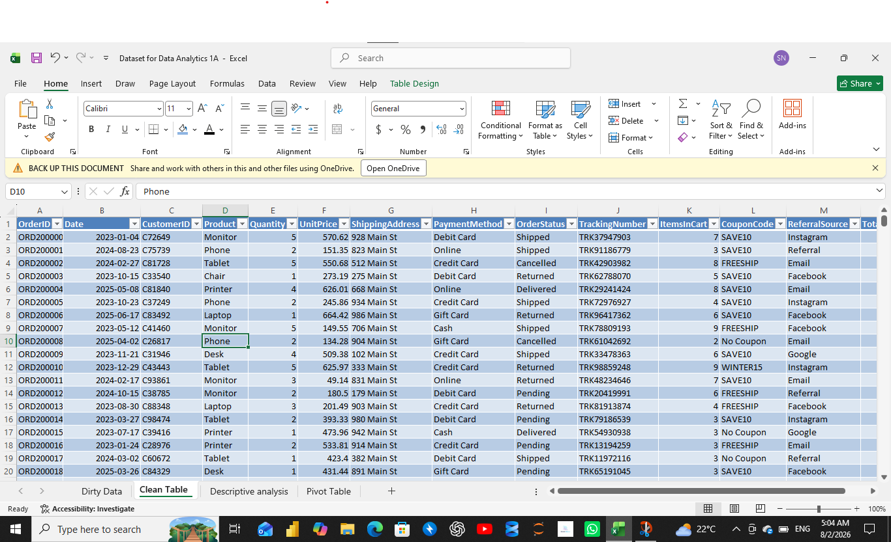

# 📊 Project 1 – Data Cleaning in Microsoft Excel

## Overview

This project focuses on cleaning and preparing a raw sales dataset using Microsoft Excel. The goal was to transform messy and inconsistent data into a clean, structured dataset ready for analysis.

---

## Project Objectives

- Clean and organize raw sales data.
- Improve data quality and consistency.
- Prepare the dataset for descriptive analysis and visualization.
- Create a reliable dataset for business decision-making.

---

## Tools Used

- Microsoft Excel
- Excel Tables
- Sorting & Filtering
- Remove Duplicates
- Data Formatting
- Find & Replace

---

## Dataset

The dataset contains customer order information, including:

- Order ID
- Date
- Customer ID
- Product
- Quantity
- Unit Price
- Shipping Address
- Payment Method
- Order Status
- Tracking Number
- Items in Cart
- Coupon Code
- Referral Source
- Total Price

---

## Data Cleaning Tasks

The following tasks were completed:

- Converted the dataset into an Excel Table.
- Checked for duplicate records.
- Standardized formatting.
- Improved data consistency.
- Organized the dataset for analysis.
- Prepared the data for Pivot Tables and Exploratory Data Analysis (EDA).

---

## Before Cleaning

## After Cleaning

## Skills Demonstrated

- Data Cleaning
- Data Preparation
- Excel Data Management
- Spreadsheet Organization
- Data Quality Assessment

---

## Outcome

The final dataset is clean, consistent, and ready for descriptive analysis, Pivot Tables, dashboards, and Exploratory Data Analysis.

---

## Author

**Stella Nwoye**

 Data Analyst | DecodeLabs Data Analytics Intern
