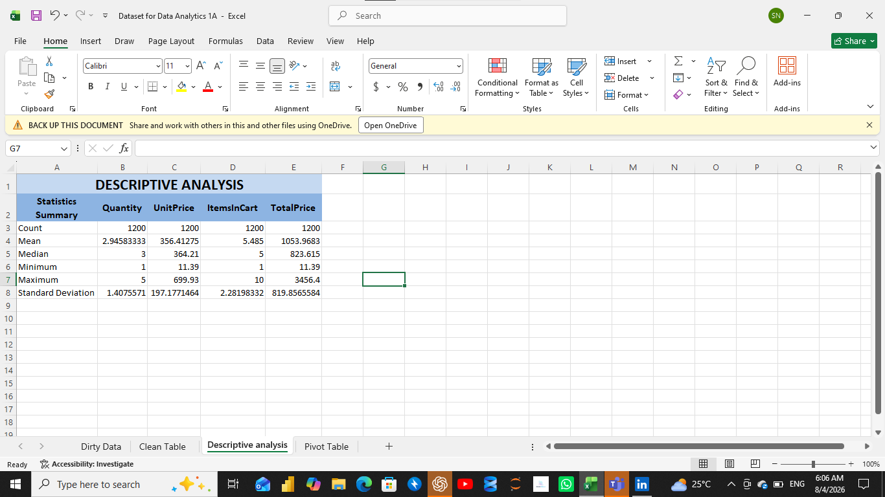
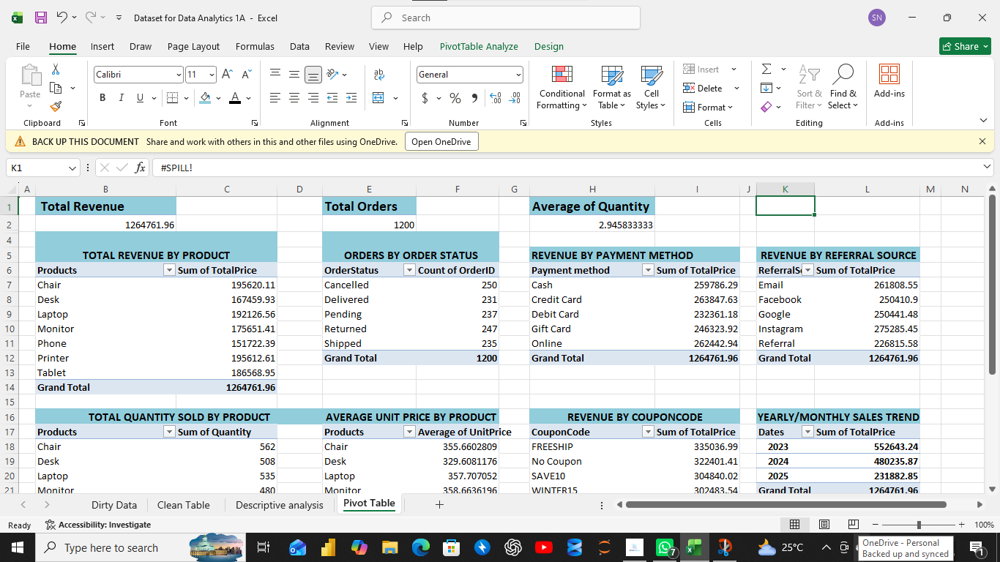

# 📊 Project 2 – Descriptive Analysis & Exploratory Data Analysis (EDA)

## Overview

This project focuses on conducting Descriptive Analysis &  Exploratory Data Analysis (EDA) on a cleaned e-commerce sales dataset using Microsoft Excel. The objective was to summarize the dataset, identify patterns and trends, and generate meaningful business insights to support data-driven decision-making.

## Project Objectives

- Perform descriptive statistical analysis.
- Explore customer purchasing behavior.
- Analyze product and sales performance.
- Identify trends and patterns within the dataset.

## Tools Used

- Microsoft Excel
- Pivot Tables
- Descriptive Statistics

## Dataset Overview

The dataset contains customer order information, including:

- Order ID
- Date
- Customer ID
- Product
- Quantity
- Unit Price
- Shipping Address
- Payment Method
- Order Status
- Tracking Number
- Items in Cart
- Coupon Code
- Referral Source
- Total Price

## Analysis Performed

The following analyses were carried out:

- Descriptive Statistical Analysis
- Product Performance Analysis
- Revenue Analysis
- Customer Purchase Analysis
- Sales Trend Exploration
- Pivot tables

# 📈 Descriptive Analysis

The descriptive statistics summarize the key characteristics of the dataset and provide an overview of numerical variables used during the analysis.

---

# 📊 Exploratory Data Analysis (EDA)

The dashboard below presents key business insights obtained from the dataset through charts and Pivot Tables.

---

## Key Skills Demonstrated

- Exploratory Data Analysis (EDA)
- Descriptive Statistics
- Data Visualization
- Pivot Tables
- Pivot Charts
- Business Insight Generation
- Excel Data Analysis

---

## Outcome

The analysis transformed raw business data into meaningful insights by identifying sales patterns, customer behavior, and product performance. The findings can support informed business decisions and future strategic planning.

---

## Author

**Stella Nwoye**

 Data Analyst 
