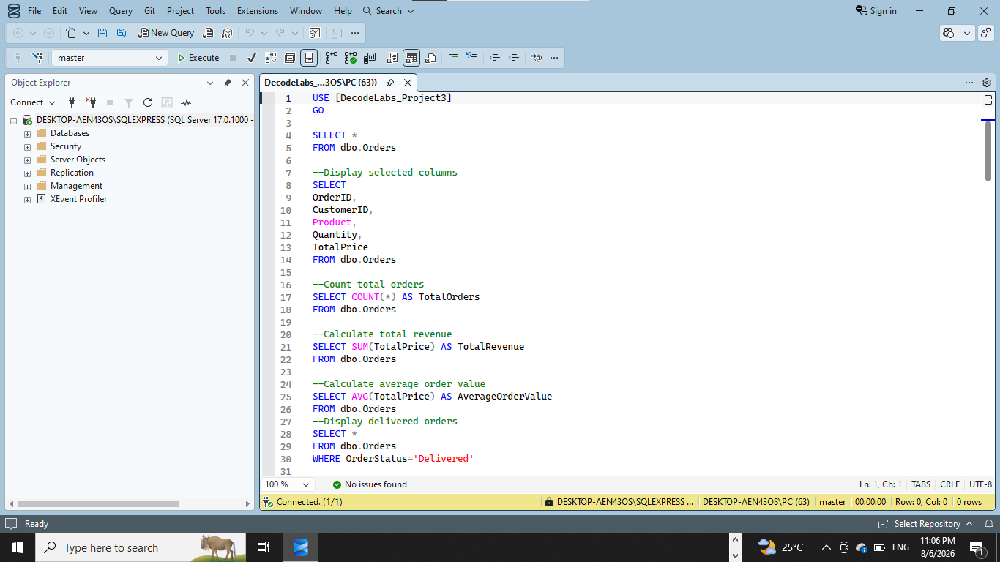
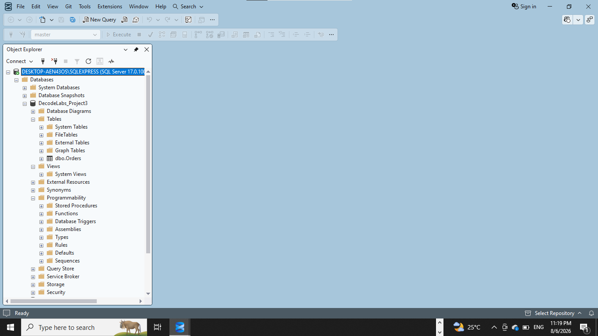

# 💾 Project 3 – SQL Data Analysis

## Overview

This project demonstrates the use of Structured Query Language (SQL) to analyze an e-commerce sales dataset. After importing the cleaned dataset into Microsoft SQL Server Management Studio (SSMS), various SQL queries were written to retrieve, summarize, and analyze the data to answer business-related questions.

---

## Project Objectives

- Import a cleaned dataset into SQL Server.
- Retrieve data using SQL queries.
- Perform data filtering and sorting.
- Generate business insights using SQL aggregate functions.
- Demonstrate fundamental SQL querying techniques.

---

## Tools Used

- Microsoft SQL Server Management Studio (SSMS)
- SQL

## Database Information

**Database Name**

`DecodeLabs_Project3`

**Table Name**

`dbo.Orders`

## SQL Concepts Applied

The following SQL concepts were used throughout this project:

- SELECT
- WHERE
- ORDER BY
- GROUP BY
- COUNT()
- SUM()
- AVG()
- MAX()
- MIN()

## Business Questions Answered

The SQL queries answered several business questions, including:

- Total number of orders
- Total revenue generated
- Average order value
- Orders by payment method
- Revenue by product
- Product sales performance
- Order status distribution
- Top customers by spending
- Revenue by referral source
- Highest and lowest value orders

---

# 💻 SQL Query Execution

The screenshot below shows successful execution of SQL queries in SQL Server Management Studio.

---

# 🗄️ Database Overview

The screenshot below shows the SQL Server database and the dbo.Orders table used for the analysis.

---

## Key Skills Demonstrated

- SQL Query Writing
- Database Management
- Data Retrieval
- Data Aggregation
- Business Data Analysis
- SQL Server Management

---

## Outcome

This project demonstrates the ability to import data into SQL Server, write efficient SQL queries, and extract meaningful business insights from a relational database. It reinforces fundamental SQL skills that are essential for data analysis and business intelligence.

---

## Author

**Stella Nwoye**

Junior Data Analyst | DecodeLabs Data Analytics Intern
